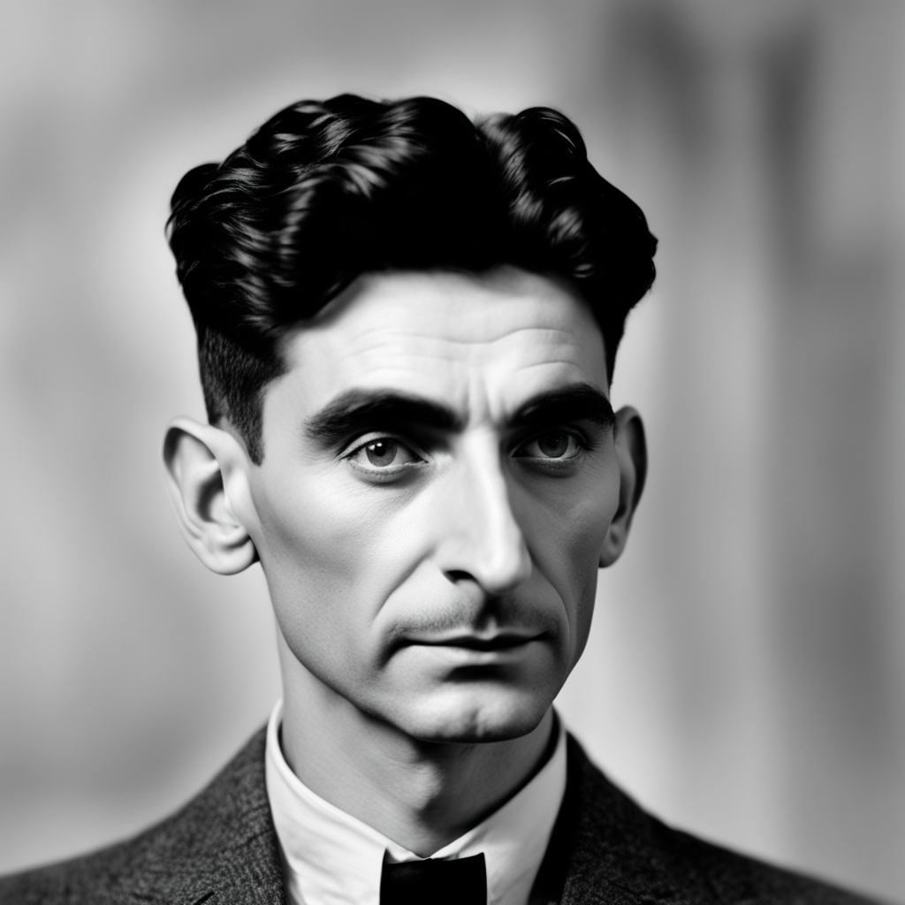

## franz 

a beginner's write of a distributed message queue .

### Properties:

1. delivering atleast once
2. batch processing -> not possible to consume only 1 message -> designed for a lot of programs and getting them to work in some time -> process entries in big batches and no retries.
3. stream of hundres/thousands of events per second due to batch processing.